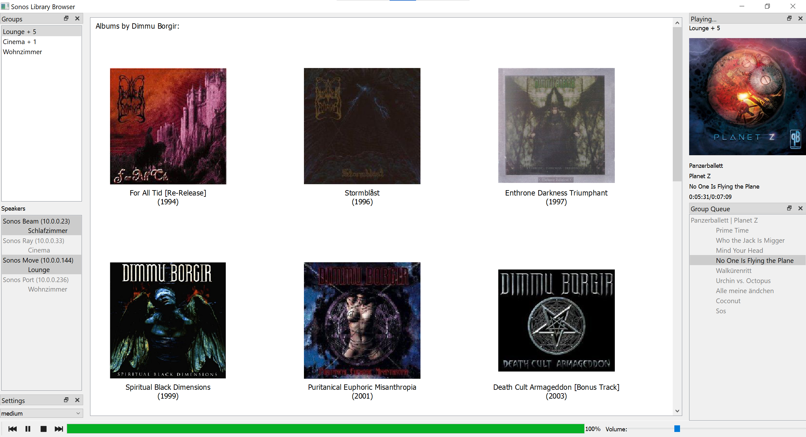

# Sonos Library Browser

## Background

After discovering the nice [soco](http://python-soco.com/) python library 
that interacts with the [Sonos](https://www.sonos.com/)
smart speaker system I played around creating this little PyQt5 program.
It is meant to solve the biggest annoyance with the stock Sonos App, which is
the local music library browsing capability.

I'm premerily listening to my own MP3s on a per album basis from a local NAS.
The Sonos App does not show any artwork for the artists and sorts the albums
alphabetically without any information about the year published. It is also
extremely slow and often takes too long to show the album art in the
list of albums.

## Program Features

This GUI initially creates a database of all album artwork in the library
and stores it locally as SQlite database. It also interprets the ID3 tags
of the library files to get the publishing date (Sonos does not store this.)

The library browser shows the Sonos groups, their queue and playing item:


On the Library tab all artists are shown with the artwork of the latest album:


Upon clicking on an artist the album list opens instantly, 
including release date:


In the album view you have the following options:

* Clicking on the background returns to the artist view.
* Left click will append the album to the selected queue.
* Right click will replace the queue with the album and start playing.

## Development Status

This is currently only a fun project for myself, so it only works on Windows
and with MP3s stored on a samba accessible drive. 
(Although it might work for any Sonos library without the release date support.)
Let me know throu the issue tracker if you think this might be useful and/of
have trouble to run it.

## Installation

Currently, I don't support any binary distributions 
(although building windows .exe is certainly possible).

To install, copy the repository, create an anaconda environment with the necessary requirements
(see conda.yml) and run ```python main.py``` from the root folder.

### Dependencies

* python >= 3.9
* PyQt5
* soco (pip installable)
* eyed3 (pip installable)

